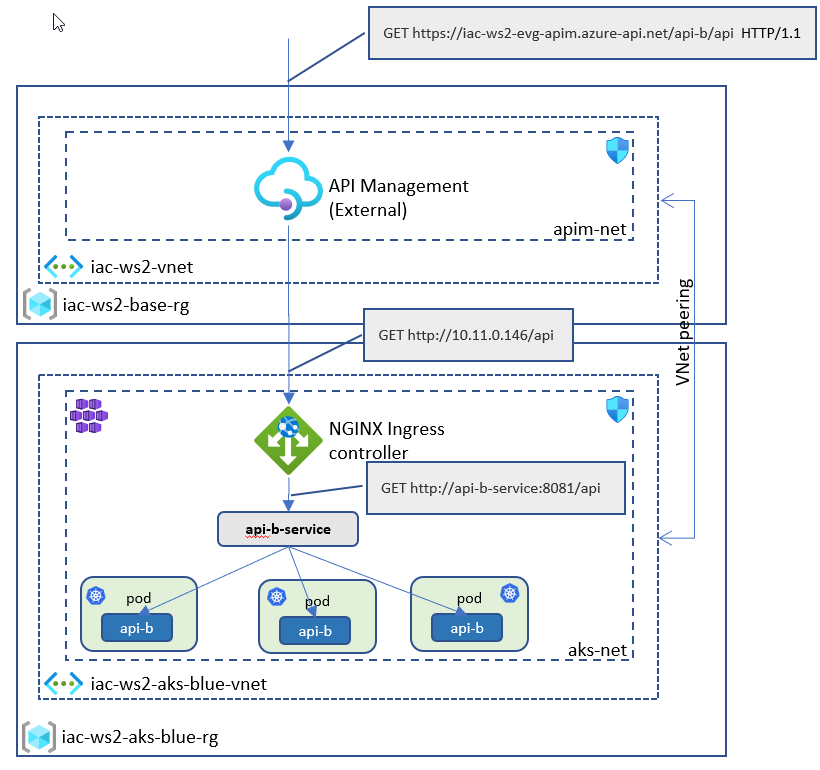
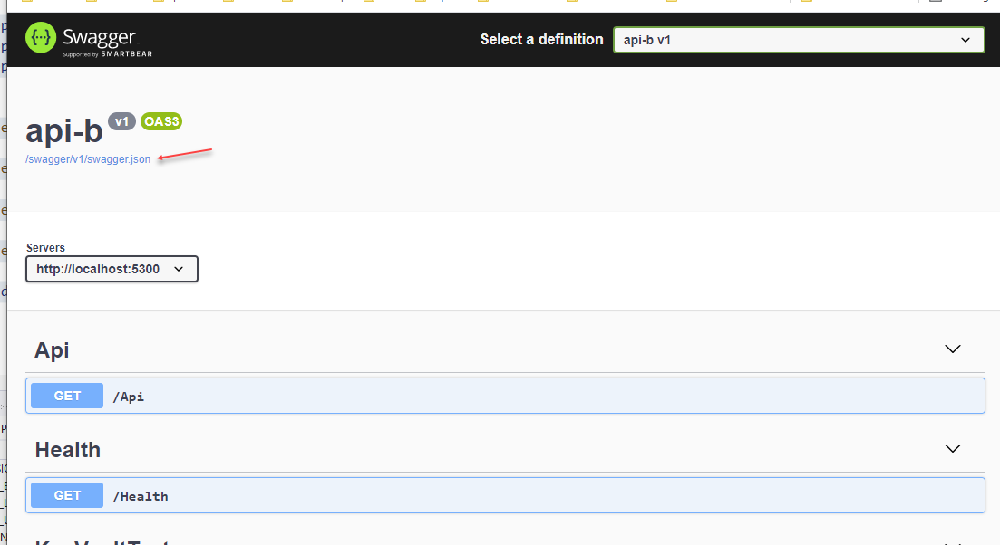
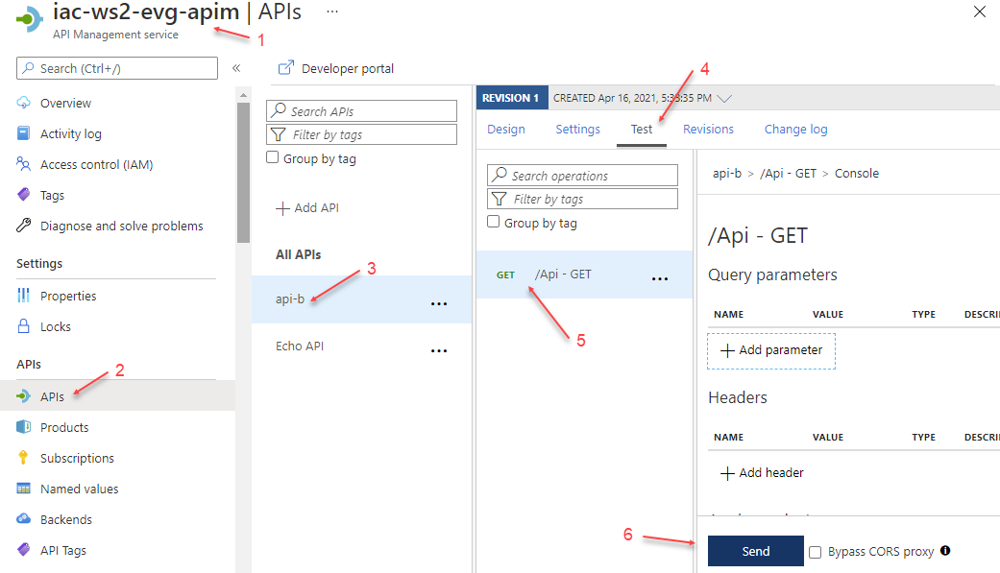
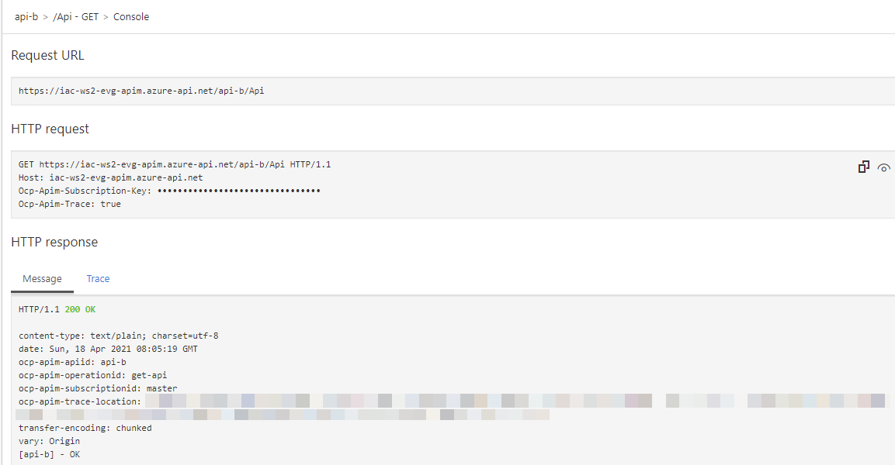
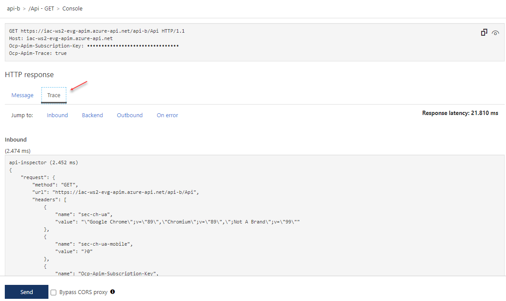
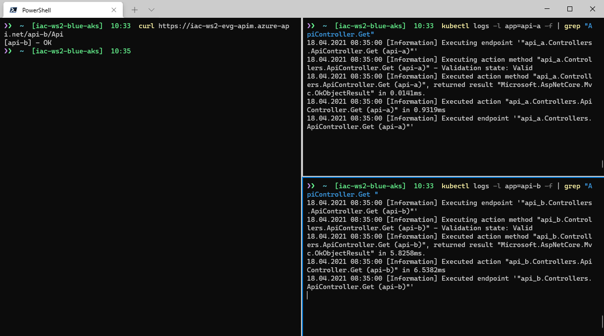

# lab-07 - deploy API to API Management

## Estimated completion time - 15 min

Now that we have private ingress controller and API Management is deployed into Private Virtual Network that is peered with AKS VNet, we can expose our API publicly by using API Management. API Management itself is a complicated product and a subject for several workshops. Today, we will keep it at the simplest level. Here is what we will implement during this lab:

## Goals



You will learn how to:

* implement swagger file for existing API with `Swashbuckle`
* deploy API to API Management using `az cli`
* test API from Azure portal
* test API using Visual Studio Code

## Task #1 - check that API Management instance is up and running

As you remember, we started provisioning of APIM instance earlier. It takes up to 60 min to provision APIM into VNet. Let's check that instance is up and running.

```bash
# Get APIM instance info
az apim show -n iac-ws2-<YOUR-NAME>-apim -g iac-ws2-rg
```

Or you can just go to Azure portal and navigate to the `iac-ws2-<YOUR-NAME>-apim` instance and check that it has status `Online`.


## Task #2 - implement swagger file for existing API with `Swashbuckle`

To import API into API Management, you need a Swagger (OpenAPI) file, describing your API specifications. The two main OpenAPI implementations for .NET are [Swashbuckle](https://github.com/domaindrivendev/Swashbuckle.AspNetCore) and [NSwag](https://github.com/RicoSuter/NSwag). I already added Swagger support into `api-b` project using `Swashbuckle`. 

Here is walk-through documentation on how to [Get started with Swashbuckle and ASP.NET Core](https://docs.microsoft.com/en-us/aspnet/core/tutorials/getting-started-with-swashbuckle?view=aspnetcore-5.0&tabs=visual-studio&WT.mc_id=AZ-MVP-5003837).

All changes, related to adding Swagger support are located at `src\api-b\Startup.cs` file.

```c#
public void ConfigureServices(IServiceCollection services)
{
...	
	services.AddSwaggerGen(c =>
	{
		c.SwaggerDoc("v1", new OpenApiInfo { Title = "api-b", Version = "v1" });
	});
...	
}
```

```c#
public void Configure(IApplicationBuilder app, IWebHostEnvironment env)
{
	if (env.IsDevelopment())
	{
...		
		app.UseSwagger();
		app.UseSwaggerUI(c => c.SwaggerEndpoint("/swagger/v1/swagger.json", "api-b v1"));
	}
...
}
```

To generate Swagger file, start `api-b` project and navigate to the `http://localhost:5300/swagger/` URL (you may need to change the port, if you use the different one).



This is how Swagger UI looks like. You can test your operations here and you can download swagger file as well. CLick on the `/swagger/v1/swagger.json` link at the top and download generated swagger file. 

I already downloaded and stored swagger file under the `src\api-b\swagger.json` location, but feel free to change it if you need to.

We will use this file to import API into API Management.

## Task #3 - deploy API to API Management using `az cli`

To import API into API Management we need two things:

* ingress controller private IP address
* API swagger file 

```bash
# Get ingress controller private IP address
kubectl get ingress api-b-ingress
NAME            CLASS   HOSTS   ADDRESS       PORTS   AGE
api-b-ingress   nginx   *       10.11.0.146   80      5d21h

# Got to the src\api-b\api-b folder
cd src/api-b

# Import api-b API to APIM using OpenAPI swagger.json file
az apim api import \
	--resource-group iac-ws2-rg --service-name iac-ws2-evg-apim \
	--path '/api-b' \
	--api-id api-b --display-name api-b \
	--service-url 'http://{INGRESS-CONTROLLER-IP}' \
	--specification-format OpenApiJson --specification-path swagger.json \
	--subscription-required false	
```

## Task #4 - test API from Azure portal

To test your api from the portal, do the following steps:



1. Open your APIM instance in Azure portal
2. Navigate to `APIs` section 
3. Open `api-b` API
4. Navigate to the `Test` tab
5. Select `/Api` operation 
6. Click `Send`

If everything is properly configured, you should get `HTTP/1.1 200 OK` with `[api-b] - OK`.



If you experiencing any issues or just curious what APIM does with request and response, go to 

## Task 5 - test API with curl

Yoy can test your APIs with `curl` as well. This time, let's watch logs both from `api-a` and `api-b` pods. 
Split Windows Terminal window in 3 sessions: 

1. Watch `api-a` logs with the following command: 
```bash
# get logs from all api-a pods and only show logs from Get endpoint
kubectl logs -l app=api-a -f | grep "ApiController.Get"
```

2. Watch `api-b` logs with the following command: 
```bash
# get logs from all api-b pods and only show logs from Get endpoint
kubectl logs -l app=api-b -f | grep "ApiController.Get"
```

3. Test your API
```bash
# Test your api 
curl https://iac-ws2-<YOUR-NAME>-apim.azure-api.net/api-b/Api
```



```bash
curl https://iac-ws2-evg-apim.azure-api.net/api-b/Api
[api-b] - OK
```

## Task 6 (optional) - test API using Visual Studio Code

APIM has an [extension for Visual Studio Code](https://marketplace.visualstudio.com/items?itemName=ms-azuretools.vscode-apimanagement) 

When installed, you can navigate to the endpoint you want to test and click `Test operation`. You may be asked to login to your Azure account when you first time use this extension.


In the test window, you can remove line requesting `{{azure-api-management-subscription-key}}`. We don't use any APIM Product, therefore we don't need provide subscription for our API. When line is removed, click `Send request`


## Useful links

* [ASP.NET Core web API documentation with Swagger / OpenAPI](https://docs.microsoft.com/en-us/aspnet/core/tutorials/web-api-help-pages-using-swagger?view=aspnetcore-5.0&WT.mc_id=AZ-MVP-5003837)
* [Get started with Swashbuckle and ASP.NET Core](https://docs.microsoft.com/en-us/aspnet/core/tutorials/getting-started-with-swashbuckle?view=aspnetcore-5.0&tabs=visual-studio&WT.mc_id=AZ-MVP-5003837)
* [API Management documentation](https://docs.microsoft.com/en-us/azure/api-management/?WT.mc_id=AZ-MVP-5003837)
* [About API Management](https://docs.microsoft.com/en-us/azure/api-management/api-management-key-concepts?WT.mc_id=AZ-MVP-5003837)
* [az apim api](https://docs.microsoft.com/en-us/cli/azure/apim/api?WT.mc_id=AZ-MVP-5003837&view=azure-cli-latest)
* [az apim api import](https://docs.microsoft.com/en-us/cli/azure/apim/api?WT.mc_id=AZ-MVP-5003837&view=azure-cli-latest#az_apim_api_import)
* [Azure API Management Extension for Visual Studio Code](https://marketplace.visualstudio.com/items?itemName=ms-azuretools.vscode-apimanagement)

## Next: AKS egress

[Go to lab-08](../lab-08/readme.md)

## Feedback

* Visit the [Github Issue](https://github.com/evgenyb/aks-workshops/issues/21) to comment on this lab. 